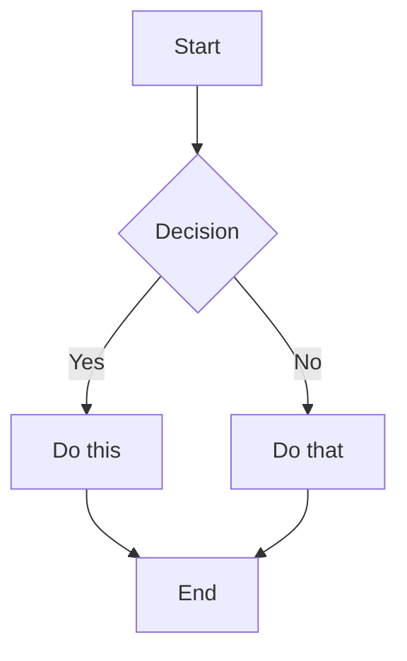

# MDX Features in Docusaurus

Docusaurus uses MDX, allowing you to write JSX within Markdown. This enables interactive documentation with React components alongside standard Markdown.

## Frontmatter

Every doc page can have YAML frontmatter:

```yaml
---
id: my-doc-id              # URL slug (defaults to filename without extension)
title: My Document Title    # Page title and default sidebar label
sidebar_label: Short Title  # Override sidebar label
sidebar_position: 3         # Position in autogenerated sidebar
description: SEO meta description for this page
keywords: [api, reference, docs]
image: /img/og-image.png    # Open Graph image
slug: /custom-url-path      # Override URL path
tags: [getting-started, api]
draft: false                # Hide from production build
unlisted: false             # Exclude from sitemap/search
hide_title: false           # Hide the title heading
hide_table_of_contents: false
toc_min_heading_level: 2
toc_max_heading_level: 3
pagination_prev: intro      # Override previous page
pagination_next: null       # Hide next page link
custom_edit_url: https://github.com/...  # Override edit URL
last_update:
  date: 2024-01-15
  author: John Doe
---
```

## Admonitions

Special callout blocks for notes, tips, warnings, etc.:

```markdown
:::note
This is a note with useful information.
:::

:::tip
Helpful tips for users.
:::

:::info
Informational content.
:::

:::warning
Important warning to be aware of.
:::

:::danger
Critical information about potential issues.
:::
```

### With Custom Titles

```markdown
:::tip[Pro Tip]
Custom title for your admonition.
:::

:::danger[Breaking Change]
This change may break existing code.
:::
```

### Nested Content

Admonitions can contain any MDX content:

```markdown
:::note[Complex Example]

You can include:
- Lists
- **Formatted** text
- Code blocks:

```javascript
console.log('Hello!');
```

And even other components!

:::
```

## Code Blocks

### Basic Syntax Highlighting

````markdown
```javascript
function greet(name) {
  return `Hello, ${name}!`;
}
```
````

### Titles

````markdown
```javascript title="src/greet.js"
function greet(name) {
  return `Hello, ${name}!`;
}
```
````

### Line Numbers

````markdown
```javascript showLineNumbers
const a = 1;
const b = 2;
const c = 3;
```
````

### Line Highlighting

````markdown
```javascript {1,4-6}
// This line is highlighted
const a = 1;
const b = 2;
// highlight-start
const highlighted = true;
// highlight-end
const d = 4;
```
````

Or with comments:

````markdown
```javascript
const normal = 1;
// highlight-next-line
const highlighted = 2;
const alsoNormal = 3;
```
````

### Diff Highlighting

````markdown
```diff
- const oldValue = 1;
+ const newValue = 2;
```
````

### npm/yarn/pnpm Tabs

````markdown
```bash npm2yarn
npm install docusaurus
```
````

Automatically generates tabs for npm, yarn, and pnpm.

### Live Code Editor

````markdown
```jsx live
function Clock() {
  const [date, setDate] = useState(new Date());

  useEffect(() => {
    const timer = setInterval(() => setDate(new Date()), 1000);
    return () => clearInterval(timer);
  }, []);

  return <p>Current time: {date.toLocaleTimeString()}</p>;
}
```
````

## Tabs

Import and use tabs for multi-platform content:

```jsx
import Tabs from '@theme/Tabs';
import TabItem from '@theme/TabItem';

<Tabs>
  <TabItem value="js" label="JavaScript" default>

```javascript
console.log('JavaScript');
```

  </TabItem>
  <TabItem value="py" label="Python">

```python
print("Python")
```

  </TabItem>
  <TabItem value="go" label="Go">

```go
fmt.Println("Go")
```

  </TabItem>
</Tabs>
```

### Synced Tabs

Tabs can sync across the page using `groupId`:

```jsx
<Tabs groupId="operating-systems">
  <TabItem value="mac" label="macOS">
    Use `brew install`
  </TabItem>
  <TabItem value="linux" label="Linux">
    Use `apt install`
  </TabItem>
  <TabItem value="windows" label="Windows">
    Use `choco install`
  </TabItem>
</Tabs>
```

## Details/Collapsible

Native HTML `<details>` element:

```markdown
<details>
  <summary>Click to expand</summary>

  This content is hidden by default.

  You can include any MDX content here:
  - Lists
  - Code blocks
  - Components

</details>
```

Or use the Docusaurus component:

```jsx
import Details from '@theme/Details';

<Details summary="Click to expand">
  Hidden content here.
</Details>
```

## Importing Components

### Custom Components

```jsx
import MyComponent from '@site/src/components/MyComponent';

<MyComponent prop="value" />
```

### Partial/Reusable Content

Create partials in `docs/_partials/`:

```markdown
<!-- docs/_partials/common-warning.md -->
:::warning
This feature is experimental.
:::
```

Import in docs:

```markdown
import CommonWarning from './_partials/common-warning.md';

<CommonWarning />
```

## Links and Assets

### Internal Links

```markdown
[Link to another doc](./other-doc.md)
[Link with anchor](./other-doc.md#section)
[Absolute path](/docs/intro)
```

### Images

```markdown


<!-- Or import for better handling -->
import screenshot from './img/screenshot.png';


```

### Static Assets

Files in `/static` are copied to build root:

```markdown
[Download PDF](/files/document.pdf)

```

### Using `require()` for Assets

```markdown
.default)
```

## Math Equations

Enable KaTeX in config:

```javascript
presets: [
  ['classic', {
    docs: {
      remarkPlugins: [require('remark-math')],
      rehypePlugins: [require('rehype-katex')],
    },
  }],
],
stylesheets: [
  {
    href: 'https://cdn.jsdelivr.net/npm/katex@0.13.24/dist/katex.min.css',
    type: 'text/css',
  },
],
```

Then use:

```markdown
Inline math: $E = mc^2$

Block math:

$$
\int_0^\infty e^{-x^2} dx = \frac{\sqrt{\pi}}{2}
$$
```

## Diagrams with Mermaid

Enable in config:

```javascript
themeConfig: {
  mermaid: {
    theme: { light: 'neutral', dark: 'dark' },
  },
},
markdown: {
  mermaid: true,
},
themes: ['@docusaurus/theme-mermaid'],
```

Usage:

````markdown

````

## MDX Plugins

### Adding Remark/Rehype Plugins

```javascript
presets: [
  ['classic', {
    docs: {
      remarkPlugins: [
        require('remark-math'),
        [require('@docusaurus/remark-plugin-npm2yarn'), { sync: true }],
      ],
      rehypePlugins: [
        require('rehype-katex'),
      ],
    },
  }],
],
```

### Common Plugins

| Plugin | Purpose |
|--------|---------|
| `remark-math` + `rehype-katex` | Math equations |
| `@docusaurus/remark-plugin-npm2yarn` | npm/yarn/pnpm tabs |
| `remark-gfm` | GitHub Flavored Markdown (tables, etc.) |

## Head Metadata

Add per-page metadata:

```jsx
import Head from '@docusaurus/Head';

<Head>
  <title>Custom Title</title>
  <meta property="og:description" content="Custom description" />
  <link rel="canonical" href="https://example.com/page" />
</Head>
```

## Browser-Only Components

For components that use browser APIs:

```jsx
import BrowserOnly from '@docusaurus/BrowserOnly';

<BrowserOnly>
  {() => {
    const MyComponent = require('./MyBrowserComponent').default;
    return <MyComponent />;
  }}
</BrowserOnly>
```

Or with `useIsBrowser` hook:

```jsx
import useIsBrowser from '@docusaurus/useIsBrowser';

function MyComponent() {
  const isBrowser = useIsBrowser();

  if (!isBrowser) {
    return <div>Loading...</div>;
  }

  return <div>Window width: {window.innerWidth}</div>;
}
```
